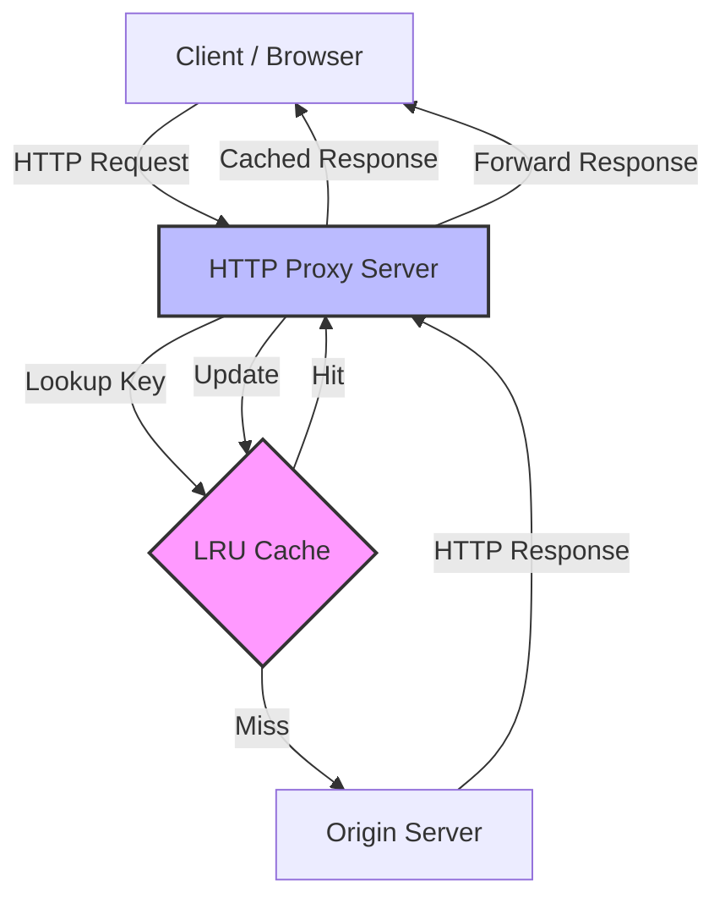

# High-Performance HTTP/1.1 Caching Proxy


A robust, compliant HTTP/1.1 web proxy server written in C. It acts as an intermediary between clients and origin servers, implementing a custom **LRU caching** mechanism and manual **HTTP protocol parsing**.

This project demonstrates low-level network programming using **BSD sockets**, custom data structure implementation (doubly linked list), and strict memory management.

## Key Features

- **HTTP/1.1 compliance**: Manually parses HTTP request/response headers, respecting complex directives like `Cache-Control` (`private`, `no-store`, `must-revalidate`) and `max-age` expiration logic.
- **LRU caching engine**: Implements a custom **Least Recently Used (LRU)** eviction policy using a **doubly linked list** to efficiently manage cache entries under memory constraints (**100KB limit per entry**).
- **Dual-stack networking**: Built on raw **BSD sockets** with support for both **IPv4** and **IPv6** traffic (`struct sockaddr_in6`), handling address resolution via `getaddrinfo`.
- **Stale entry handling**: Detects expired content and automatically fetches fresh copies from origin servers when `max-age` is exceeded.
- **Memory safety**: Rigorous manual memory management (`malloc`/`free`) validated with **Valgrind** to ensure zero memory leaks during request lifecycles.

## Tech Stack

- **Language**: C (Standard C99)
- **Networking**: BSD Sockets, TCP/IP
- **Tools**: Valgrind, GDB, cURL
- **Containerization**: Docker

## System Architecture



## Project Structure

- `main.c`: Entry point handling socket connections, request parsing, and cache lookup logic.
- `proxy.h`: Header file defining the `CacheEntry` structure and LRU algorithm interfaces.
- `Makefile`: Build script to compile the `htproxy` executable.
- `Dockerfile`: Minimal environment for reproducible builds and testing.

## Usage

### 1) Build Locally

```bash
make
```

This generates the `htproxy` executable.

### 2) Run the Proxy

The proxy accepts a port number (`-p`) and an optional flag (`-c`) to enable caching:

```bash
# Syntax: ./htproxy -p <port> [-c]
./htproxy -p 8080 -c
```

### 3) Test with cURL

You can configure your browser to use the proxy, or test directly via command line:

```bash
# Send a request through the proxy (-x)
curl -v -x http://localhost:8080 http://www.example.com
```

### 4) Run with Docker

Build and run the proxy in an isolated container:

```bash
docker build -t http-proxy .
docker run -p 8080:8080 http-proxy
```

## Academic Disclaimer

This project was created for educational purposes as part of the Computer Systems course at the University of Melbourne. Please do not copy this code for your own coursework submission.

